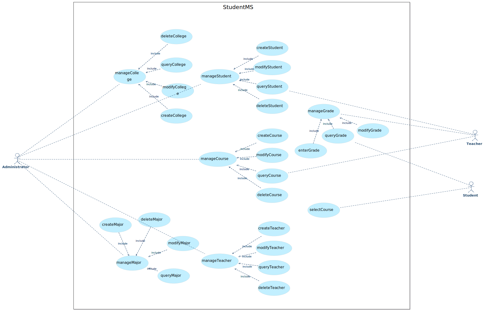
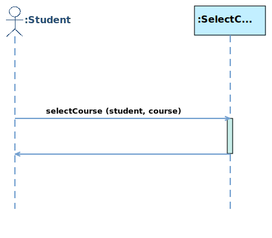
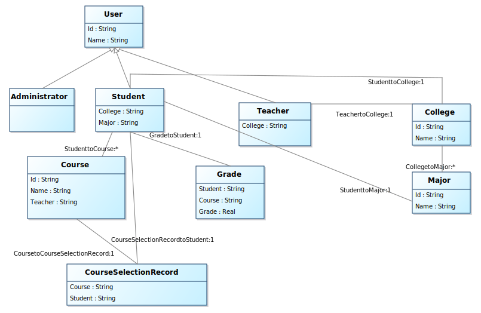
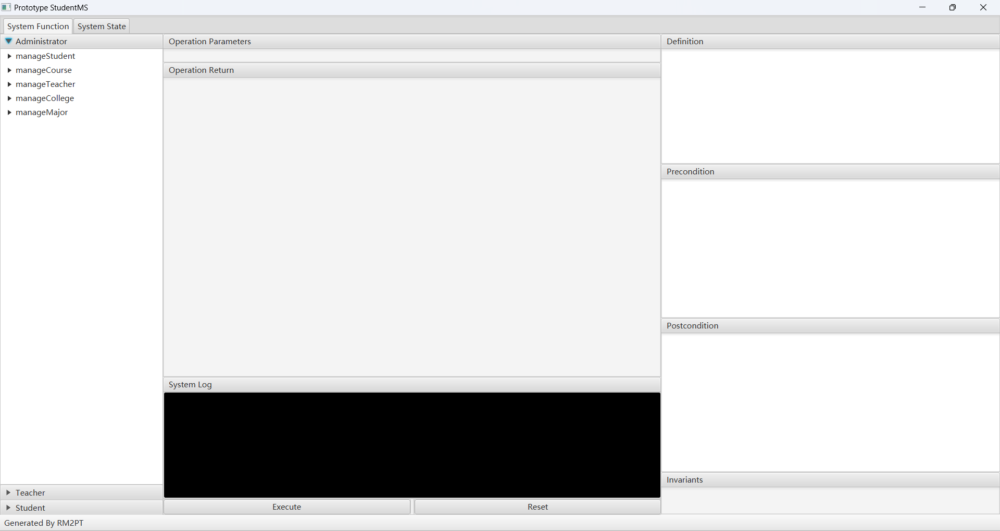

# StudentMS

1. 建模结果截图

   1. Use Case Diagram

      

   2. System Sequence Diagram

      

   3. Concept Class Diagram

      

2. 简要说明

   ​	该模型描述了一个学生管理系统，主要包括管理员、学生、教师三个参与者，主要功能包括学生管理、教师管理、课程管理、学生选课和成绩录入及查询等功能。

3. 模型规模说明

   1. 自然语言需求
      1. 用户需求数量：23
      2. 系统需求数量：16
   2. Actor数量：3
   3. 用例数量：30
   4. 系统顺序图数量：25
   5. 系统操作总数：24
   6. 系统合约数量：24
   7. 类数量：9

4. 需求原型化结果截图

   